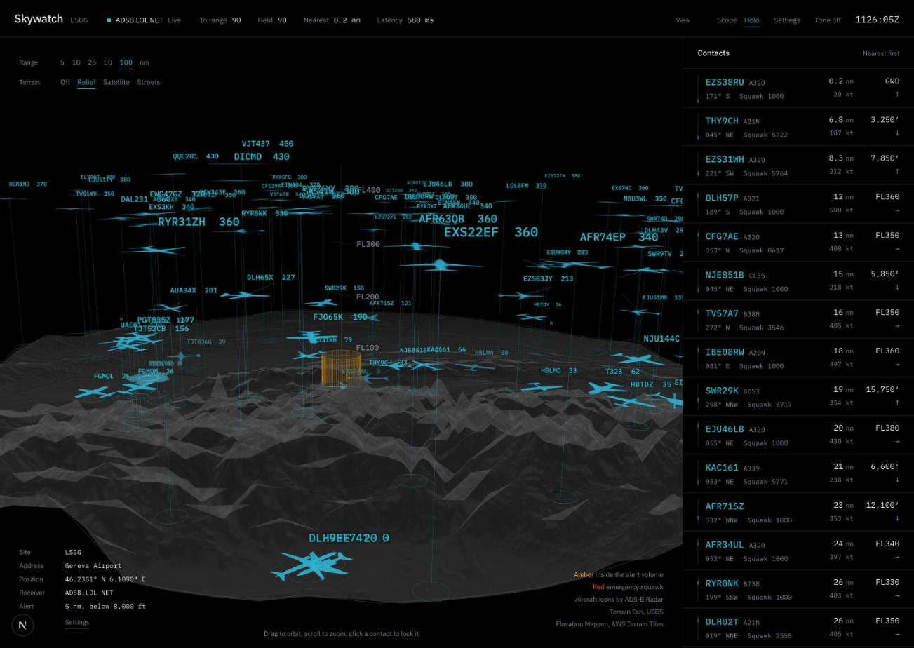

# SKYWATCH

[](https://github.com/mutatedplague/skywatch/actions/workflows/ci.yml)
[](LICENSE)
[](CONTRIBUTING.md)

A radar console for the sky over your house. Plug in a $30 RTL-SDR dongle, or
use a free community feed with no hardware at all, and every aircraft within
range appears at its real altitude over the real terrain, with a live contact
list, proximity alerts and a full track readout.

One `docker compose up`, then the console asks you four questions. No `.env`
to edit, no account to make.



- **Your own radio, or none.** A bundled `dump1090-fa` decoder drives a USB
  RTL-SDR. Without one, adsb.lol, airplanes.live and OpenSky give you real
  traffic for free, and a simulator runs the console with nothing at all.
- **Set up from the browser.** Type your address, pick a feed, test it, go. The
  receiver keeps the station so every console that connects sees the same one.
- **Tells you what is overhead.** Anything close and low turns amber, jumps to
  the top of the list, and can ring a tone. The volume is yours to size.
- **The sky as a volume.** Every contact floats at its real altitude over
  real relief, with its trail behind it and its next minute ahead. Drag to
  orbit, click to lock. Five themes.
- **Runs anywhere Docker does.** A Raspberry Pi in the loft is plenty.

---

## Quick start

```bash
git clone https://github.com/mutatedplague/skywatch.git
cd skywatch
docker compose up -d --build
```

Open <http://localhost:3000>. The first time, the console walks you through the
station: where the antenna is, which feed to use, what counts as overhead. It
is live before you finish reading this sentence.

### With your own RTL-SDR

The bundled decoder claims the dongle through `/dev/bus/usb`, which needs a
Linux host — a Raspberry Pi, a NUC, a server. Start it with the `sdr` profile:

```bash
docker compose --profile sdr up -d --build
```

Before the first run, stop the kernel's DVB driver from grabbing the dongle:

```bash
echo 'blacklist dvb_usb_rtl28xxu' | sudo tee /etc/modprobe.d/blacklist-rtl.conf
sudo rmmod dvb_usb_rtl28xxu 2>/dev/null || true
```

In setup, choose **Your own receiver**. The decoder is already at the default
address, and **Test connection** will tell you how many aircraft it hears.

### On macOS or Windows

Docker Desktop cannot pass a USB device into a Linux container, so the bundled
decoder will not see a dongle on a Mac or a PC. Three ways round it:

1. **Use a community feed.** Pick adsb.lol or airplanes.live in setup. No
   hardware, no account, real traffic.
2. **Run the decoder natively, the rest in Docker.** Build
   [dump1090-fa](https://github.com/flightaware/dump1090) on the host and run it
   with `--write-json`, serve that directory, and point SKYWATCH at
   `http://host.docker.internal:8080/data/aircraft.json`.
3. **Put the radio on a Raspberry Pi** running PiAware or dump1090-fa, and give
   SKYWATCH its address: `http://<pi>:8080/data/aircraft.json`.

### Without Docker

Node 20 or newer:

```bash
npm run install:all
npm run dev:backend    # receiver on :4000
npm run dev:frontend   # console on :3000
```

---

## First run

Setup has four steps, each one screen. Everything it asks can be changed later
under **Settings** in the top rail, and **Skip for now** runs the console on
simulated traffic until you come back to it.

| Step | What it asks | Notes |
| --- | --- | --- |
| **Station** | A name, and where the antenna is | Type an address and it is looked up for you, use the browser's location, or paste coordinates. Use the rooftop, not the town: range and bearing are measured from here. |
| **Receiver** | Where the aircraft come from | Your own receiver, adsb.lol, airplanes.live, OpenSky or the simulator. **Test connection** fetches once and reports what it found. If the bundled decoder is not running, setup notices and selects adsb.lol instead. |
| **Alert volume** | What counts as overhead | A radius and a ceiling. Three miles and twelve thousand feet catches anything on approach without flagging the airway traffic passing over at cruise. |
| **Review** | Everything above | **Start the scope** saves it on the receiver. |

The station is saved to a Docker volume, so it survives rebuilds and restarts.

---

## The console

### The view

Each contact sits at its real altitude above a stalk dropped to its ground
position, so height is something you see rather than read. Behind every contact is its trail, fading toward the
tail — approach paths descend, departures climb, a hold is a stacked oval —
and ahead of it a line showing the next minute of flight, climb or descent
included. The amber drum is the alert volume itself — its radius and its lid
are the two numbers you set — so "close and low" becomes a shape. Drag to
orbit, scroll to zoom, click a contact to lock it: a reticle settles on it, its
trail comes up to full strength and its minute ahead goes dashed while
everything else dims a notch.

With terrain on, the disc becomes the actual ground. The same elevation data
that shades the relief raises it in 3D; the site's own elevation is the zero
plane, and the flight-level ruler shifts to match. Dramatic country — the
Rockies, the Alps — is drawn on the same vertical scale as the aircraft, so a
ridge at 9,000 ft and an aircraft at 9,000 ft sit at the same height. Gentle
country would vanish at that scale, so it is drawn taller, up to ten times,
and the legend says by how much. Two things stay true whatever the ground is
drawn at: the ruler at the site, and every stalk, which is always the
aircraft's real height above the ground beneath it. Altitude itself is
exaggerated against the horizontal on purpose: 45,000 ft is barely 7 nm, which
would be flat against a 50 nm disc, so the ruler is labelled with real flight
levels to keep it honest.

### Reading it

| What you see | What it means |
| --- | --- |
| Stalk from the ground | The contact's height; its foot is where it is over the map |
| Fading line behind | Where it has been since it came into range, altitude included |
| Line ahead | One minute of travel at the current speed, climb or descent included |
| Amber symbol | Inside your alert volume — airborne, close and low |
| Red symbol | Squawking 7500, 7600 or 7700 |
| Amber drum | The alert volume: its radius and its lid are the two numbers you set |
| White ring on a glyph | The locked contact; its line ahead goes dashed |
| Numbers on the rings | Distance in nautical miles; bearings round the rim |
| Ruler at the centre | Flight levels, measured from the ground under your site |

Click any contact in the scene or in the list to lock it; the bar along the
bottom then carries its full track. `Esc` clears the lock. **Range** sets how
far the disc reaches, and **Tone** plays a short sound when a new contact
enters the airspace.

### Contacts and alerts

The list on the right is sorted nearest first. Anything inside the alert
volume — within the radius, below the ceiling, and airborne — is amber on the
scope and promoted to an **Overhead** block at the top. Taxiing aircraft at an
airport site are inside the volume but not overhead anyone, so they stay in the
main list.

### Settings

**Settings** in the top rail opens the same fields setup asked for — name,
position, receiver, alert volume and range — plus the display accent. Station
changes save on the receiver and are pushed to every connected console, so the
rings redraw as soon as you hit save. What the console saves wins over `.env`;
**Revert to .env** puts it back. The accent is this browser's own and applies
as soon as it is picked.

### Terrain

**Terrain** puts the ground around your site under the traffic. **Relief**
is drawn by the console itself from open elevation data: a hillshade lit from
the north-west, with contour lines at an interval picked from the relief in
view, so a river valley in flat country and an alpine ridge each come out
legible. Over it — and over **satellite** imagery — go the roads, rivers,
lakes, towns and airports from OpenStreetMap, drawn from vector tiles served
by [OpenFreeMap](https://openfreemap.org) with no key and no account: major
roads at any range, smaller ones as you zoom in, airports by ICAO code. Dark
**streets** is a ready-made map. Every layer means fetching from a server that
can infer roughly where your site is from what it is asked for; **Off** keeps
the console from fetching any. Attribution for the active layer is shown in
the corner of the scope, as those services require.

### Themes

**Accent**, under Settings, picks one of five palettes — the original radar
green, blue, cyan, violet and a neutral grey — that recolour the chrome, the
scene and the terrain tint together. Amber alerts and red emergency squawks
keep their meaning in every theme.

---

## Hardware

Any RTL2832U dongle decodes ADS-B, but the ones sold for the job — an RTL-SDR
Blog v3 or v4, a FlightAware Pro Stick — include a 1090 MHz filter and a
low-noise amplifier, which is usually worth more than anything you can do in
software.

Range is almost entirely about the antenna and where it sits. ADS-B is
line-of-sight at 1090 MHz, so height beats gain: a cheap quarter-wave ground
plane in the attic will beat an expensive antenna indoors. Keep the coax short,
and if you can only fix one thing, raise the antenna. Indoors, expect 40 nm; a
good antenna on a roof with a clear horizon sees 150 nm or more.

`DUMP1090_GAIN=adaptive` lets the decoder tune its own gain, which is a good
starting point. To chase the last few miles, pin a value in dB and compare
message rates at `http://localhost:8080/data/stats.json`.

---

## Configuration

You do not have to touch any of this; setup covers the parts that matter.
Everything the console saves wins over the environment. Set values here for a
headless install, or for a receiver you do not want changed from a browser.

| Variable | Default | What it does |
| --- | --- | --- |
| `HOME_LAT`, `HOME_LON` | *(empty)* | Position in decimal degrees. Empty: setup asks, and simulated traffic runs until it knows. |
| `SITE_NAME` | `HOME` | Label shown on the console. |
| `ADSB_SOURCE` | `dump1090` | `dump1090`, `adsblol`, `airplaneslive`, `opensky` or `demo`. |
| `DUMP1090_URL` | bundled decoder | Where to fetch `aircraft.json`. |
| `RANGE_NM` | `100` | How far out to pull traffic. The scope zooms within this. |
| `ALERT_RADIUS_NM` | `3` | Airborne contacts nearer than this may count as overhead. |
| `ALERT_ALTITUDE_FT` | `12000` | …and lower than this. Both must be true. |
| `STALE_SECONDS` | `75` | Drop a contact this long after its last report. |
| `POLL_MS` | per source | Override the poll interval. |
| `OPENSKY_CLIENT_ID` / `_SECRET` | *(none)* | OpenSky API credentials. |
| `FRONTEND_PORT` | `3000` | Console port. |
| `BACKEND_PORT` | `4000` | Receiver API port. |
| `NEXT_PUBLIC_API_URL` | *(none)* | Only needed behind a reverse proxy; otherwise the browser derives it. |
| `ALLOW_SITE_EDIT` | `true` | `false` makes the console read-only: no setup, no site changes. |
| `GEOCODE_URL` | Nominatim | Geocoder behind the address box. `off` removes the box. |
| `STATE_DIR` | `state` | Where what the console saves is persisted. |

See [`.env.example`](.env.example) for the annotated version, including the
radio-side settings (`DUMP1090_GAIN`, `DUMP1090_DEVICE`,
`DUMP1090_MAX_RANGE_NM`, `DUMP1090_VERSION`, `DUMP1090_EXTRA_ARGS`) that apply
only to the bundled decoder.

### Data sources

| Source | Needs | Poll | Notes |
| --- | --- | --- | --- |
| Your own receiver | RTL-SDR | 1 s | Best picture of your own sky, and the only one that keeps working offline. Any dump1090-fa, readsb, PiAware or tar1090 `aircraft.json` works. |
| [adsb.lol](https://adsb.lol) | Nothing | 2 s | Community network. Traffic within 250 nm of your site. |
| [airplanes.live](https://airplanes.live) | Nothing | 2 s | Community network. Keep to one request per second. |
| [OpenSky Network](https://opensky-network.org) | Free account for useful limits | 10 s | Anonymous access is heavily throttled; an API client lifts it. |
| Simulator | Nothing | 0.5 s | Synthetic traffic around your site. |

### What reaches the internet

Nothing, with your own receiver and terrain off. Otherwise: the chosen feed
sees your position (it has to, to answer); the elevation, map and vector tile
servers behind the terrain layer can infer it; and the address box sends what
you type to the geocoder. Each of those is one setting away from off.

---

## Running it for real

**Raspberry Pi.** A Pi 3 or later runs the whole stack with the dongle
attached. Follow *With your own RTL-SDR* above; the images build on the Pi
itself (allow a few minutes the first time).

**Read-only console.** Set `ALLOW_SITE_EDIT=false` and configure through
`.env`. The console hides setup, the site panel and the address box, and the
receiver refuses every change.

**Behind a reverse proxy.** The console talks to the receiver on port 4000 by
default, derived from the page's own hostname. If the API is on a different
origin — `https://radar.example.com/api`, say — set `NEXT_PUBLIC_API_URL` to it
before building. There is no authentication: anyone who can reach the receiver
can read the picture and, unless editing is off, move the site. Keep it on your
own network, or behind something that asks for a login. See
[SECURITY.md](SECURITY.md).

---

## API

The receiver is useful on its own:

| Endpoint | Returns |
| --- | --- |
| `GET /api/health` | Liveness, source name, contact count |
| `GET /api/config` | Site, feed, range, alert volume |
| `GET /api/aircraft` | The current picture, same shape as a socket frame |
| `POST /api/site` | Move the site, change the feed, resize the alert volume |
| `POST /api/source/test` | One fetch from a feed with given settings, without saving |
| `GET /api/geocode?q=` | Places matching an address, as `{label, lat, lon}` |
| `GET /api/geocode?lat=&lon=` | The address nearest a position |
| `WS /ws` | A snapshot per poll |

`POST /api/site` takes any of `lat`+`lon`, `address`, `site`, `source`,
`dump1090Url`, `openskyClientId`, `openskyClientSecret`, `rangeNm`,
`alertRadiusNm`, `alertAltitudeFt`, or `{"reset": true}` to fall back to
`.env`. It validates against the receiver's own bounds and answers `400` with a
reason. `POST /api/source/test` takes the same fields and answers
`{ok, aircraft, inRange, latencyMs, error}`.

```bash
curl -X POST localhost:4000/api/site -H 'content-type: application/json' \
  -d '{"lat": 39.2242, "lon": -82.9893, "source": "adsblol", "alertRadiusNm": 8}'

curl -s localhost:4000/api/aircraft | jq '.aircraft[0]'
```

---

## How it works

```
RTL-SDR ──► dump1090-fa ──► aircraft.json ──► receiver ──► WebSocket ──► console
 1090 MHz    decode          HTTP/1s          track +       ~1/s        canvas
                                              geometry                   scope
```

The **receiver** (`backend/`, Node + TypeScript + Fastify) polls one source,
normalises every record into a single shape, computes range and bearing from
your site, keeps a position history per aircraft, ages out contacts that stop
reporting, and pushes the whole picture to every connected console over a
WebSocket. dump1090-fa, adsb.lol and airplanes.live all speak the same readsb
record format, so one normaliser covers all three; OpenSky gets its own
adapter. The station — position, feed, alert volume — lives in a small JSON
file the console writes through the API, and the receiver rebuilds its source
and tracker the moment it changes.

The **console** (`frontend/`, Next.js + React + three.js) draws the scene in
WebGL at display refresh rate while the data underneath updates about once a
second. The camera's drift and the lock reticle's breathing are animation;
everything else comes straight off the feed.

---

## Development

```bash
npm run install:all

# receiver on :4000 — demo traffic needs no radio and no network feed
cd backend && ADSB_SOURCE=demo HOME_LAT=39.7392 HOME_LON=-104.9903 npm run dev

# console on :3000
cd frontend && npm run dev
```

`npm run typecheck` and `npm run build` at the root cover both packages. CI
runs those, builds the three images, and brings the stack up on the simulator
to check the console and the API answer.

## Contributing

Bug reports, aircraft type mappings, new feed adapters and receiver support are
all welcome — see [CONTRIBUTING.md](CONTRIBUTING.md). Security issues go
through [SECURITY.md](SECURITY.md) rather than the issue tracker.

## Licence

MIT. See [LICENSE](LICENSE).

Aircraft silhouettes are from the free icon set by
[ADS-B Radar for macOS](https://adsb-radar.com), used with the attribution the
author asks for; terrain tiles carry their own attribution on the scope. Full
notices in [NOTICE.md](NOTICE.md).
